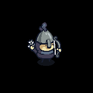
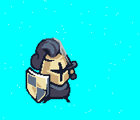
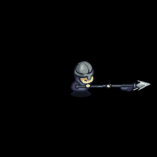
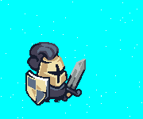
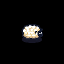
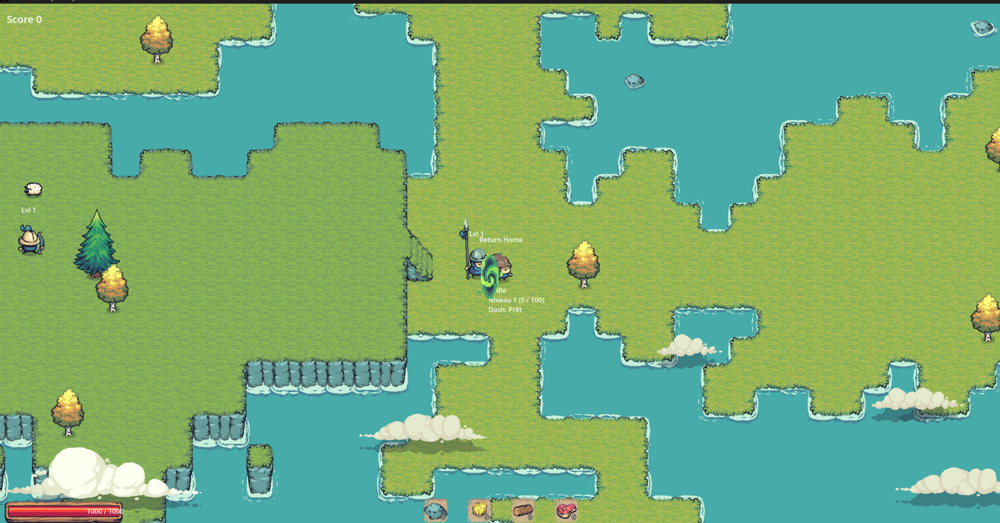
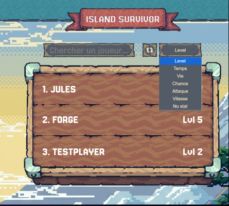

# IslandSurvivor

IslandSurvivor est un projet de jeu vidéo de survie ambitieux, conçu autour d'une architecture logicielle moderne et robuste. Ce projet démontre l'application de principes d'ingénierie logicielle avancés dans un contexte de développement de jeu vidéo (Godot) et de systèmes distribués (.NET).

L'objectif principal de ce travail est de présenter une solution logicielle complète, de la logique métier pure à l'interface utilisateur temps réel, tout en maintenant une séparation stricte des responsabilités et une testabilité maximale.
(Projet encore en cours)

---

## Architecture Technique (N-Tier)

Le projet adopte une architecture en couches (N-Tier) permettant une modularité et une scalabilité optimale. Cette structure facilite le partage de la logique métier entre le client de jeu (Godot) et les outils d'administration (Web/API).

### Découpage de la solution :
*   **Core (Noyau)** : Bibliothèque de classes pure .NET contenant les interfaces, les modèles de domaine et la logique métier. Totalement découplé du moteur de jeu.
*   **IslandSurvivor (Client)** : Interface de jeu développée sous Godot 4.x (.NET), gérant le rendu, les entrées utilisateur et les retours sensoriels.
*   **API (Backend)** : Service ASP.NET Core Web API assurant la persistance des données et la communication entre le client et la base de données.
*   **Infrastructure** : Couche de persistance utilisant Entity Framework Core (SQL Server) et implémentant les patterns d'accès aux données.
*   **Web (Dashboard)** : Application Blazor permettant la visualisation des statistiques et la gestion administrative.

---

## Design Patterns & Qualités Logicielles

Afin de garantir un code maintenable et professionnel, plusieurs patrons de conception (design patterns) ont été rigoureusement appliqués :

### Repository Pattern
L'accès aux données est centralisé via des dépôts (Repositories), isolant la logique métier des détails d'implémentation de la persistance (EF Core). Cela permet de changer de source de données ou de simuler des données pour les tests sans modifier le reste du système.

### Architecture Orientée Événements (Event-Driven)
Le système utilise un `EventBus` personnalisé au sein du projet Core, couplé à un `SignalManager` dans Godot. Cette approche permet un couplage faible entre les systèmes : par exemple, la destruction d'une ressource déclenche un événement intercepté de manière asynchrone par l'inventaire, les statistiques et le système audio sans que ces modules ne se connaissent directement.

### Machine à États (State Machine)
L'intelligence artificielle des NPCs (Passifs et Hostiles) est gérée par une machine à états robuste. Chaque comportement (Idle, Chase, Flee, Attack) est encapsulé dans une classe distincte, facilitant l'ajout de nouveaux comportements et garantissant une transition fluide entre les états.

  
  
  

---

## Méthodologie & Développement Augmenté par l'IA

Ce projet a été réalisé en adoptant une approche moderne de "Développeur Augmenté". En tant qu'utilisateurs avancés d'agents IA, nous avons intégré l'IA non seulement pour la génération de code, mais aussi comme partenaire d'analyse et de révision architecturale.

*   **Analyse de Contraintes** : Utilisation de l'IA pour valider la conformité aux principes SOLID et à l'architecture N-Tier.
*   **Productivité Accrue** : Accélération du développement des modules répétitifs (boilerplate) pour se concentrer sur les algorithmes complexes de génération procédurale.
*   **Documentation Dynamique** : Tenue rigoureuse de journaux d'utilisation de l'IA (`jules/ai_usage_*.md`) pour tracer les décisions techniques et les contributions de l'assistant.
  

  
  

---

## Aperçu visuel du projet

### Environnement et
Ici est montre une des carte qui sera possible de jouer 

  
  

### Interface
Voici un petit apercus de notre site web pour afficher le score des joueurs 

  

---

## Stratégie de Qualité & CI/CD

La fiabilité de la solution est assurée par une stratégie de tests rigoureuse et une automatisation complète via Azure DevOps :

*   **Tests Unitaires** : Validation de la logique métier et des algorithmes dans le projet `Core`.
*   **Tests d'Intégration** : Vérification des flux de données entre l'API ASP.NET Core et la base de données SQL Server.
*   **Pipeline CI/CD** : Un pipeline YAML automatise la restauration, la compilation de la solution globale, l'exécution des tests et l'exportation "headless" du client Godot pour Windows.

---

## Technologies Utilisées

*   **Moteur de jeu** : Godot 4.6.1 (.NET 8.0 / 9.0)
*   **Langage** : C# (Nullable Reference Types activés)
*   **Backend** : ASP.NET Core Web API
*   **Frontend Web** : Blazor Web App
*   **Base de données** : SQL Server / Entity Framework Core
*   **Tests** : xUnit (Unitaires et Intégration)
*   **Outils** : Visual Studio 2022, Git, Agents IA

---

## Installation et Configuration

### Prérequis
*   Visual Studio 2022
*   SDK .NET 8.0 et .NET 9.0
*   Godot 4.x (version .NET)

### Procédure
1.  Cloner le dépôt.
2.  Ouvrir la solution `ProjetJeu.sln` dans Visual Studio.
3.  Restaurer les dépendances NuGet.
4.  Appliquer les migrations de base de données :
    `Update-Database -Project Infrastructure`
5.  Lancer les projets de démarrage (API et Web).
6.  Lancer le projet `IslandSurvivor` via l'éditeur Godot.

---

## Démonstration Vidéo

Pour visualiser le comportement des IA et les interactions physiques en jeu, vous pouvez consulter la séquence de poursuite :
[Visionner la séquence de poursuite (MP4)](Images/chasingSequence.mp4)

---

## Auteurs

Ce projet est le résultat d'un effort collaboratif par des étudiants passionnés en programmation au Cégep de Sainte-Foy :

*   **Kevin Houle**
*   **Edouard Couture**
*   **Antoine Masson**
*   **Delphine Martin**
*   **Charles-Phillipe Warren**
