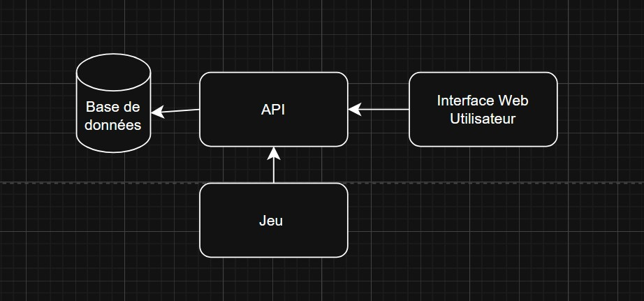
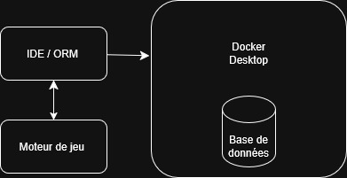

# **Définition** de la cible du projet pour la session

## **Participants**
1. Charles-Philippe Warren
2. Delphine Martin
3. Edouard Couture
4. Kévin Houle
5. Antoine Masson

## **Énumération des besoins exprimés par le client**
- [X] Mise en place d’un personnage principal **- Complété**
- [X] Mise en place d’un systeme de navigation (changement) d'îles **- Complété**
- [X] Mise en place d’un systeme de stats pour les entités **- Complété**
- [X] Mise en place d’un systeme de collection de resosurces **- Complété**
- [X] Mise en place d’un systeme de d'enemie NPC **- Complété**
- [ ] Mise en place d’un systeme de gestion du temps de jeu (effet en jeu) **- À faire**
<<<<<<< HEAD
- [ ] Mise en place d’un systeme d'utilisation de ressources **- À faire**
=======
- [ ] Mise en place d’un systeme d'un système d'utilisation de ressources **- En cours**
>>>>>>> 70b8fe7d2906492a553c1c5871b0636a19b2a24a
- [ ] Mise en place d’un systeme d'une fin de partie (victoire / mort) **- À faire**
- [ ] Mise en place d’un système de calcul de score en jeu **- En cours**
- [ ] Transmission des scores vers un service web **- En cours**
- [ ] Intégration d’un tableau des scores (scoreboard) accessible depuis un site web **- En cours**
## **Technologies utilisées.**

- #En production 
- [X] Diagramme de l’architecture de production (serveurs, services et liens entre eux)

- [X] Services utilisés

* Base de données : Microsoft SQL Server (MSSQL). Stockage persistant des joueurs, scores et statistiques.

* Backend / API : ASP.NET Core. Sert de pont entre le jeu (Godot) et la base de données pour sécuriser les transactions.

* Frontend Web : Blazor (ASP.NET). Interface utilisateur pour la consultation des classements et du profil.

**Client de jeu :** Godot Engine (C#). Application lourde exécutée par l'utilisateur final.
- [X] Méthodologie d’utilisation des services
* Le jeu communique avec l'API via des requêtes sécurisées pour mettre à jour le `HighScore` et les ressources. L'accès direct à la base de données est réservé à l'API pour garantir l'intégrité des données (prévention de la triche).

- #En développement
- [X] Diagramme de l’architecture de production (serveurs, services et liens entre eux)

- [X] Services utilisés (peut y en avoir plusieurs et doivent être documentés)
* IDE : Visual Studio (C#) pour le développement backend et web.

* Moteur de jeu : Godot (version .NET/C#).

* Docker Desktop : Utilisation d'une image officielle `mcr.microsoft.com/mssql/server` pour faire tourner la base de données localement sans installation lourde.

* ORM : Entity Framework Core pour la gestion des migrations de schémas (Code-First).
- [X] Méthodologie d’utilisation des services
* Chaque développeur lance un conteneur Docker local pour la base de données. Cela permet d'isoler les tests et de s'assurer que l'environnement est identique pour tous les membres de l'équipe (évite le "ça marche sur ma machine").

- #En déploiement
- [X] Services utilisés (peut y en avoir plusieurs et doivent être documentés)
* Hébergement : À valider (Probablement Azure ou un serveur interne du Cégep).

* Registre d'images : Docker Hub (pour stocker et versionner les images du serveur web et de la BD).

- [X] Localisation de l’hébergement des services
* Canada Central.
- [X] Méthodologie d’utilisation des services
* Le déploiement automatisé (CI/CD) est privilégié. Lors d'un merge sur `Master`, une image Docker est construite et poussée sur le registre, puis déployée sur le serveur de production. 

*Note : Aucun dossier de test ou données de test n'est envoyé lors de la création de l'image de production.*

- [x] Estimation des coûts

Prix vm bd SQL server: Standard_B2ats_v2 - 2 processeurs virtuels, 1 Gio de mémoire (7,67 $USD)

Web App: Essentiel B1 100 1 1.75 10 3 99.95% 0,018 USD 13,14 USD 

Total 28,61$ CAD

#Gestion des Sources (Git)

### Branches principales

* **`master` (ou `main`) :** Branche de production. Code stable et testé.

* `dev` : Branche d'intégration. Regroupe les fonctionnalités terminées avant le passage en production.

### Procédures de fusion (Merge Requests)

L'équipe applique des règles de révision strictes pour garantir la qualité du code :

1. **Création de branche par récit :**
    * Chaque récit nécessite une branch individuel basé sur `dev`

    * Effectuer un commit par tâche complétée

    * Fournir une description brève du contenu modifié

2.  **Vers la branche `dev` :**

    * Nécessite **une (1) revue** par un membre n'ayant pas contribué à la tâche.

    * Validation obligatoire par **Jules**.

3.  **Vers la branche `master` :**

    * Nécessite **deux (2) revues** par des membres tiers (excluant l'auteur).

    * Validation obligatoire par **Jules**.

    * Tests de non-régression obligatoires.
   
4.  **Nomenclature au niveau des branches**

* Mettre le numeros de la User Story au debut du nom de la branche
    
* Titre la User Story ou court descriptif de la User Story 

## **Notre "Definition of done"**
- Développement terminé
- Tests unitaires,d'intégration continue passent et tests manuels (aucune erreur)
- Documentation est mise à jour
- Le code ajouté et ses tests sont revus et validés par au moins 2 autres personnes

## **État de situation**
- Statut du projet 
- [X] État actuel
    1. Ce qui est fonctionnel en production: Rien n'est fonctionnel en production nous commençons un nouveau projet de zéros.
    2. Ce qui est en développement: Rien n'est fonctionnel en développement nous commençons un nouveau projet de zéros.
    3. Ce qui est en déploiement ou près du déploiement: Rien n'est fonctionnel en déploiement nous commençons un nouveau projet de zéros.

La partie ci-dessous n'est pas tenue à jour depuis sa création

## **Création et Attribution des récits utilisateurs et tâches**
- Delphine Martin :
  * [Implementer l'affichages des menus](https://dev.azure.com/csf-dfc/Projet%20Jeu/_workitems/edit/8397)
  * [Implementer l'ATH du joueur](https://dev.azure.com/csf-dfc/Projet%20Jeu/_workitems/edit/8396)

- Kevin Houle : 
  * [Implementer le système de point](https://dev.azure.com/csf-dfc/Projet%20Jeu/_workitems/edit/8404)
  * [Implementer le gestionnaire de statistique](https://dev.azure.com/csf-dfc/Projet%20Jeu/_workitems/edit/8403)

- Edouard Couture :
  * [Ajouter la création de la map de base](https://dev.azure.com/csf-dfc/Projet%20Jeu/_workitems/edit/8466)
  * [Implementer la génération d'une map](https://dev.azure.com/csf-dfc/Projet%20Jeu/_workitems/edit/8400)
  * [Implementer l'apparition d'éléments sur la map](https://dev.azure.com/csf-dfc/Projet%20Jeu/_workitems/edit/8402)
  * [Implementer les maps à la main](https://dev.azure.com/csf-dfc/Projet%20Jeu/_workitems/edit/8826)

- Antoine Masson : 
  * [Ajouter des ressources dans le jeu](https://dev.azure.com/csf-dfc/Projet%20Jeu/_workitems/edit/8394)
  * [Mettre en place un manager d'inventaire](https://dev.azure.com/csf-dfc/Projet%20Jeu/_workitems/edit/8600)

- Charles Philippe Warren :
  * [Implementer le mouvement du joueur](https://dev.azure.com/csf-dfc/Projet%20Jeu/_workitems/edit/8398)
  * [Implementer l'intéractions du joueur](https://dev.azure.com/csf-dfc/Projet%20Jeu/_workitems/edit/8399)